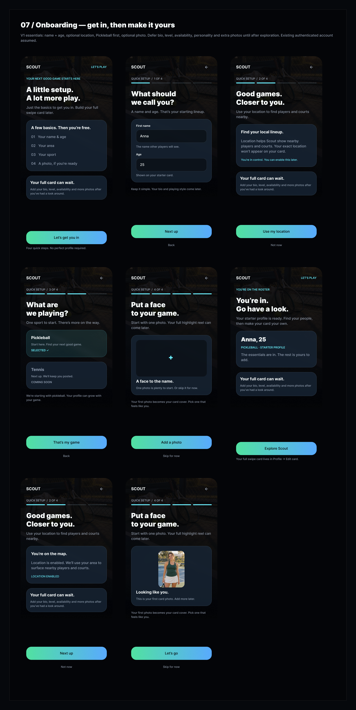
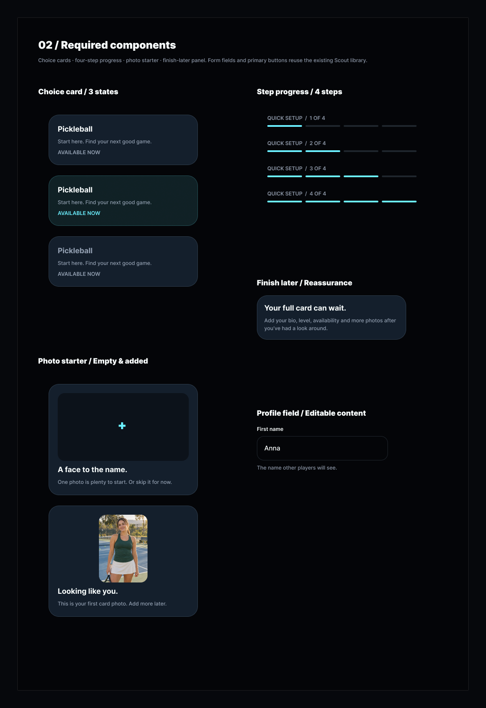

# Tech Plan: Scout V2 Onboarding

**Status:** Proposed · **Scope:** iOS + backend/BFF · **Design:** [07 / Onboarding](https://www.figma.com/design/qEktHx6Uo52KgAYNt4VHw3/Scout-V2?node-id=143-2).

Authenticated account → welcome → basics → location → sport → photo → ready → Swipe Deck. Require name, age and starting sport; location/photo are optional. Defer bio, level, availability, traits, preferences and additional photos to Profile → Edit card. Do not manufacture a community score for a new player.

## 1. Component status

Inspected Figma on 2026-09-25, including all eight screen states, five onboarding component families and build notes. Matches the structure of [Swipe](scout-v2-swipe-design.md) and the ordered `item/version/parameters/components` contract in [BFF factory](bff-response-factory.md).

**Status means V2 implementation:** New = build; Modification needed = extend delivered code; Ready to go = reuse delivered code unchanged. The inspected `scout-ios` tracked HEAD contains only README.md, consistent with the existing plans: **all feature implementations below are New; no delivered V2 components qualify as Modification needed or Ready to go.** Figma already has reusable designs; that does not make their Swift implementations complete. Names below are exact proposed implementation identifiers, not claims of existing classes. Shared planned dependencies are owned once in the linked plans.

### Fields, choices and progress

| Exact Figma name / variants | V2 status | Proposed Swift name / wire `item` | iOS requirement | Backend requirement / example `parameters` |
| --- | --- | --- | --- | --- |
| Onboarding / Profile Field | New; existing Figma design | `OnboardingProfileField` | Editable First name/Age, helper text, keyboard/focus and inline errors; never use sample Anna/25 as defaults | Allowlisted field keys, saved values, validation rules; `{"field":"firstName","label":"First name","value":"Anna","required":true}` |
| Onboarding / Choice Card — Default, Selected, Unavailable | New | `OnboardingChoiceCard` | Single selection; text/accessibility state; unavailable Tennis cannot activate | Catalog IDs/availability; `{"sportId":"pickleball","title":"Pickleball","state":"selected"}`; Tennis: `{"sportId":"tennis","title":"Tennis","state":"unavailable"}` |
| Onboarding / Step Progress — Step=1/2/3/4 | New | `OnboardingStepProgress` | Four segments and spoken step count; exclude welcome/ready | `{"step":2,"total":4}` derived from workflow, not component index |
| Onboarding / Photo Starter — Empty, Added | New | `OnboardingPhotoStarter` | Native PhotosPicker, preview, upload/retry/cancel state; first photo becomes cover | Owned, finalized media only; `{"state":"added","photoId":"photo_1","url":"https://example.invalid/photo.jpg"}`; empty: `{"state":"empty"}` |
| Onboarding / Finish Later | New | `OnboardingFinishLater` | Read-only reassurance panel, not a skip-all button | `{"title":"Your full card can wait.","detail":"Add your bio, level, availability and more photos after you’ve had a look around."}` |

### Shared dependencies and screen composition

| Exact Figma name / role | V2 status | Proposed Swift name / wire mapping | iOS requirement | Backend requirement / example `parameters` |
| --- | --- | --- | --- | --- |
| Atoms / Primary Button | New; reuse Figma design | `ScoutPrimaryButton` → `OnboardingActions` primary slot | Gradient button, disabled/pending state; callback through native dispatcher | `{"primary":{"label":"Next up","action":"continue"}}` |
| Top navigation / Back; Secondary / Back, Not now, Skip for now | New | `OnboardingNavigation`, `OnboardingActions` secondary slot | 44-point controls; both Back controls share one handler | `{"secondary":{"label":"Not now","action":"skip_location"}}`; navigation: `{"canGoBack":true}` |
| Court atmosphere / Ink fade; glass panels; Flexible space | New; shared foundations planned in Swipe | `OnboardingScreen` with `ScoutGlassPanel` | Bundle approved background; native gradient, safe areas, keyboard-aware scroll and pinned actions; no rigid screenshot coordinates | `OnboardingScreen`: `{"stepId":"basics","revision":3,"status":"in_progress"}`; visual tokens local |
| Step introduction / captions / wordmark | New | `OnboardingText` and `OnboardingNavigation` | Approved typography roles, Dynamic Type and decorative-image semantics | `{"role":"title","text":"What should we call you?"}`; SCOUT mark native |
| Quick setup preview | New | `OnboardingSetupPreview` | Four numbered rows, not editable controls | `{"steps":["Your name & age","Your area","Your sport","A photo, if you’re ready"]}` |
| Profile basics | New | `OnboardingFieldGroup` | Glass container with ordered field children | `{"groupId":"basics"}` + `components` |
| Location permission / location-enabled | New | `OnboardingLocationCard` | Explanation → native permission request → enabled state; denial follows Not now | `{"state":"not_set"}` or `{"state":"saved","areaLabel":"Brooklyn"}`; OS authorization stays native |
| Starter profile summary | New | `OnboardingProfileSummary` | Render persisted name/age/sport; no invented score | `{"firstName":"Anna","age":25,"sportId":"pickleball","profileState":"starter"}` |
| Loading / retry / unsupported fallback (not drawn) | New dependency; owned by BFF plan | `ScoutStateCard` | Reuse planned native fallback once delivered | `{"reason":"onboarding_unavailable"}` |
| Explore Scout handoff / Profile → Edit card | New integration; destination views owned elsewhere | `OnboardingCoordinator` → `SwipeDeckScreen` / profile edit route | Replace onboarding stack on completion; keep deferred profile fields editable later | Allowlisted destination `{"destination":"swipe"}`; no server URL execution |

Only `OnboardingScreen` and `OnboardingFieldGroup` accept ordered children. Navigation/actions are single required shell slots pinned outside scrolling content; leaves omit `components`. Shared glass/buttons are native composition, not additional network requests. Each wire item has a `<Item>Parameters` DTO and registry adapter; `OnboardingCoordinator`, `OnboardingViewModel` and `BFFOnboardingRepository` are new non-rendering types.

## 2. Component composition contract

Logical routes are proposals, following the existing BFF plan. Authenticate every request; derive account ID from JWT. Templates compose authorized profile data and a server-owned onboarding state machine, then validate the resolved tree. iOS owns rendering, unsaved edits, permission prompts and picker interaction. No arbitrary field bindings, URLs, code or navigation strings execute on-device.

| Endpoint | Purpose |
| --- | --- |
| `GET /v1/onboarding` | Canonical saved state + compatible current-step template; first read yields welcome; completed users bypass onboarding |
| `GET /v1/onboarding?stepId=basics` | Render an already-reachable step for Back without regressing durable progress |
| `POST /v1/onboarding/transitions` | Save/validate current step and advance or explicitly skip an optional step; typed business result |
| `POST /v1/onboarding/photo-uploads` | Allocate short-lived upload destination for one authorized image; use existing storage infrastructure if available |
| `POST /v1/onboarding/photo-uploads/{uploadId}/finalize` | Verify ownership/file, attach staged photo to draft; return durable photo ID and new draft revision |

### Example step endpoint

Shortened basics response; production template also includes navigation, introduction and actions from the inventory. `revision` is the optimistic-concurrency revision of saved onboarding data, distinct from template revision. The initial/returning render supplies saved values, available actions and server-approved validation rules.

```json
{
  "version": 1,
  "requestId": "req_1",
  "template": {"id":"onboarding_basics","revision":1},
  "components": [{
    "item":"OnboardingScreen","id":"onboarding","version":1,
    "parameters":{"stepId":"basics","revision":3,"status":"in_progress"},
    "components":[
      {"item":"OnboardingStepProgress","id":"progress","version":1,"parameters":{"step":1,"total":4}},
      {"item":"OnboardingFieldGroup","id":"basics_fields","version":1,"parameters":{"groupId":"basics"},"components":[
        {"item":"OnboardingProfileField","id":"first_name","version":1,"parameters":{"field":"firstName","label":"First name","value":"Anna","required":true}},
        {"item":"OnboardingProfileField","id":"age","version":1,"parameters":{"field":"age","label":"Age","value":25,"required":true,"input":"integer"}}
      ]}
    ]
  }]
}
```

Use all envelope, capability negotiation, stable-ID, limits and required-slot rules from the factory plan. Missing/unknown required field or action blocks continuation with native retry/update UI; unknown optional reassurance may be omitted. Do not silently omit required inputs or treat an unsupported screen as completed. Server selects only supported `(item, version)` pairs; ship native renderers before enabling templates.

### Transition and media examples

All mutation requests carry `expectedRevision` and `idempotencyKey`. Scope keys to actor/operation and compare payload hash; replay the original result for identical retries and reject changed payloads. Check idempotency before stale-revision rejection. Save + progress + completion/profile writes are transactional. A success returns `result`, UI reads return `template/components`, failures return `error`; never combine them.

```json
{"stepId":"basics","action":"continue","expectedRevision":3,"idempotencyKey":"save_basics_1","values":{"firstName":"Anna","age":25}}
```

```json
{"version":1,"requestId":"req_2","result":{"revision":4,"status":"in_progress","nextStepId":"location"}}
```

Other transition request `values` (same metadata required):

| Step / action | JSON fragment | Meaning |
| --- | --- | --- |
| welcome / `start` | `{"values":{}}` | Advance to basics |
| location / `continue` | `{"values":{"location":{"latitude":40.71,"longitude":-74.00,"accuracyMeters":1000}}}` | Permission granted and fix available; validate and derive private coarse area; never return exact coordinates on public cards |
| location / `skip_location` | `{"values":{}}` | Record skipped, advance; proposal: preserve a previously saved area rather than silently deleting it |
| sport / `continue` | `{"values":{"sportId":"pickleball"}}` | Validate available sport; Tennis rejected even if a client forces selection |
| photo / `continue` | `{"values":{"photoId":"photo_1"}}` | Commit owned finalized photo as cover and enter ready |
| photo / `skip_photo` | `{"values":{}}` | Enter ready without a new cover; preserve an existing cover on revisits |
| ready / `complete` | `{"values":{}}` | Revalidate essentials and mark onboarding complete; return destination |

```json
{"expectedRevision":6,"idempotencyKey":"upload_1","contentType":"image/jpeg","byteLength":240000}
```

```json
{"version":1,"requestId":"req_3","result":{"uploadId":"upload_1","uploadUrl":"https://example.invalid/signed-upload","expiresAt":"2026-09-25T20:10:00Z"}}
```

```json
{"expectedRevision":6,"idempotencyKey":"finalize_1"}
```

```json
{"version":1,"requestId":"req_4","result":{"photoId":"photo_1","revision":7,"state":"ready"}}
```

```json
{"version":1,"requestId":"req_5","result":{"revision":9,"status":"completed","destination":"swipe"}}
```

Upload bytes only to an approved storage origin. Finalization verifies actual file type, size/dimensions and ownership, strips sensitive metadata and is retry-safe; temporary uploads need expiry/orphan cleanup. Picker cancellation changes nothing. Upload failure leaves Retry/Skip available. PhotosPicker avoids requiring broad photo-library access; camera is not shown and is out of scope. URLs above are fixtures.

### Progress, validation and resume

| State | Advance rule | Back / resume behavior |
| --- | --- | --- |
| welcome | Let’s get you in → basics | New authenticated users only; no auth screens in scope |
| basics (1/4) | Trimmed nonblank first name + integer age within approved bounds | Back → welcome; retain input |
| location (2/4) | Use my location → enabled state → Next up; Not now or denial skips | Back → basics; do not reprompt denied users automatically |
| sport (3/4) | Pickleball selected by default; That’s my game commits selection | Back → location; Tennis remains coming soon |
| photo (4/4) | Add a photo → Added → Let’s go, or Skip for now | Back → sport; show saved/staged image and retry unfinished upload |
| ready | Explore Scout commits completion then opens Swipe Deck | Relaunch before completion resumes ready; after completion enters main shell |

Persist per-account draft values, revision, highest reachable/current resume step, optional-step disposition and completion timestamp server-side. Accepted transitions advance resume state; Back changes only presentation. Cache unsaved edits in account-scoped protected local storage for process restarts; clearly indicate unsaved/offline status. A fresh GET is authoritative for committed values. Do not overwrite dirty fields on refresh; on 409 fetch current state and offer reapply/review, never last-write-wins silently. Clear local drafts on sign-out/account switch; reject late responses from another account. Across devices resume from the last acknowledged transition, not unsent edits.

Validate locally for feedback and independently on the server. Name rules must support Unicode; define length limits without imposing invented character restrictions. Age bounds/eligibility and age-versus-DOB storage are unresolved product decisions; current design asks for integer age, not birth date. Do not infer DOB or increment stored age without an approved policy. Photo and location cannot become completion requirements. Invalid coordinates, unavailable sports, unowned/unfinalized media and unreachable step transitions are rejected. Full profile completeness is separate from onboarding completion and discovery eligibility.

## 3. Implementation checklist

### iOS

- [ ] Implement inventory DTOs/renderers, `BFFOnboardingRepository`, `OnboardingViewModel` and coordinator using shared registry/session/transport foundations; views never call Supabase directly.
- [ ] Native location manager handles notDetermined/authorized/denied/restricted, reduced accuracy and no-fix timeout. Request only on tap; denial follows Not now, timeout offers retry/skip. Device permission is not a server-authoritative fact; reconcile on foreground without unexpectedly reopening the flow.
- [ ] Persist edits and acknowledgements separately; disable duplicate submissions, preserve keyboard focus/values on error, cancel obsolete reads and reconcile uncertain writes using the same key.
- [ ] Match all eight Figma screen states; scroll with keyboard/Dynamic Type, accessible labels/selected state, non-color progress, 44-point targets, Reduce Motion/Transparency.
- [ ] Gate navigation on confirmed completion. Explore Scout replaces the onboarding stack with Swipe; no Back into setup. Profile → Edit card is a later destination, not another required onboarding step.
- [ ] No external deep-link scheme is specified by Figma. Proposed behavior: retain one validated internal destination through auth/onboarding, then recheck authorization after completion; fallback to Swipe. A deep link must never bypass required steps or execute a BFF-supplied arbitrary URL. Final precedence needs agreement below.

### Backend

- [ ] Define versioned schemas/templates for welcome/basics/location/sport/photo/ready, catalog and validation rules; compile only compatible components and return saved-state values.
- [ ] Add minimal per-account draft/progress persistence, owner-only access/RLS, optimistic revisions and atomic idempotent transitions; reject skipped prerequisites and cross-account access. Keep draft state separate from the published profile.
- [ ] At completion project essentials, optional area/cover and explicit unrated state into the starter profile atomically. Repeated completion returns the same outcome; GET reports completed even if the response was lost.
- [ ] Implement owned media upload/finalize and cleanup; define private location precision/retention and public distance projection. Do not put raw location/name/age/photo URLs in logs or analytics.
- [ ] Enforce downstream eligibility separately. Skipping optional fields must allow exploration; whether an incomplete profile can appear in results or send invites needs an explicit domain rule.

### Errors, loading and analytics

```json
{"version":1,"requestId":"req_6","error":{"code":"validation_failed","retryable":false,"fieldErrors":[{"field":"age","code":"out_of_range"}]}}
```

| Condition | Behavior |
| --- | --- |
| Initial read / submit / upload | Native loading/retry surface; button spinner for writes; photo progress local. Keep entered values; never show ready before acknowledgement |
| 422 validation | Inline localized field error + focus first invalid field; retain all inputs |
| 401 / 403 | Refresh session once; then sign-in for 401. For 403 show access failure without retry loop |
| 409 stale revision | Refresh canonical draft and reconcile edits; no automatic overwrite |
| Offline / timeout / 429 / 5xx | Keep draft and show retry; bounded backoff/Retry-After. Uncertain write retries retain key; never advance optimistically |
| Expired upload / malformed or unsupported response | Renew authorized upload, or required-component retry/update fallback; preserve draft; allow photo skip |

Events: `onboarding_started`, `onboarding_step_viewed`, `onboarding_step_submitted`, `onboarding_step_completed`, `onboarding_step_skipped`, `onboarding_validation_failed`, `onboarding_location_permission_result`, `onboarding_photo_upload_result`, `onboarding_resumed`, `onboarding_completed`, `onboarding_explore_opened`. iOS emits actual views/native outcomes; server emits acknowledged transitions/completion. Attach event ID, pseudonymous account/session, step, draft revision, template revision, app version and allowlisted outcome/error code. Deduplicate durable outcomes by transition ID/idempotency key; view events by visible-step session. Never send field values, coordinates or media URLs. Measure step conversion, resume success, skip rates, upload/validation failures and completion-to-Swipe failures; infer abandonment from inactivity, not a guaranteed quit event.

## 4. Decisions needed before tickets

- Name length and age eligibility bounds; storing self-reported age versus a separately designed DOB flow and update policy.
- Location precision/retention, photo limits/processing and incomplete-profile discovery/action eligibility.
- Confirm proposed ready→complete boundary, revisit skip semantics and authenticated deep-link destination precedence (design only specifies Swipe).
- Assign iOS/backend owners. Runtime limits and copy/rule schemas must be approved before implementation; this plan does not approve migrations.

## 5. Delivery and acceptance

- [ ] Contract fixtures cover six steps, both location/photo variants, all choice/progress variants, unknown optional/required items and old-client template negotiation.
- [ ] Integration covers back/edit/resume, force quit, offline edits, denied/restricted/reduced-accuracy location, picker cancel, upload expiry/failure, double tap, lost-response retry, concurrent devices, account isolation, stale revision and repeated completion.
- [ ] Verify server/client validation parity, unavailable Tennis rejection, optional-field completion, no fabricated score, no private values in telemetry and gated deep links.
- [ ] Human UI acceptance against captures at small screen/large text; verify Explore Scout handoff and later Profile → Edit card integration.
- [ ] Ship renderers first, then compatible templates behind a cohort flag. Monitor failures/conversion; rollback template/flag without deleting drafts or completed profiles. Shared foundation delivery is a dependency, not completed work.

## Ticket breakdown and story points

Draft tickets only. Follow existing 0.25-point increments and maximum 2 points per ticket; include focused tests/review. Shared app/session/registry/transport/state-card foundations belong to BFF; glass/typography and Swipe destination belong to Swipe. Do not estimate them twice. Estimates assume decisions above are resolved; split any expanded scope.

### Section effort summary

| Section | iOS points | BE points | Total points |
| --- | ---: | ---: | ---: |
| Contracts and components | 4 | 1 | 5 |
| Progress and persistence | 2 | 3 | 5 |
| Location and photo | 2.5 | 2.5 | 5 |
| Navigation, analytics and acceptance | 2 | 1.5 | 3.5 |
| **Total** | **10.5** | **8** | **18.5** |

| Ticket | Points | Scope / acceptance |
| --- | ---: | --- |
| [BE] Define onboarding schemas and templates | 1 | Six steps, catalog, field/action contracts, capability fixtures |
| [iOS] Build onboarding shell and static composition | 1.5 | Navigation/actions/button, text, preview, finish-later, summary and glass composition |
| [iOS] Build fields, choices and progress | 1.5 | Editable/invalid states and all designed variants |
| [iOS] Register onboarding DTOs/renderers | 1 | Typed adapters and required-slot fixtures |
| [BE] Persist draft and enforce transitions | 1.5 | Owner isolation, revisions, prerequisites, skip/resume behavior |
| [BE] Add idempotent completion/profile projection | 1.5 | Transactional writes, replay, concurrency and unrated profile |
| [iOS] Integrate repository, draft and progression | 2 | Back, restart, offline edits, conflicts and uncertain-write reconciliation |
| [iOS] Add location permission flow | 1 | Denial, reduced accuracy, timeout and enabled state |
| [BE] Save private area and project location state | 0.75 | Validation, approved precision and privacy tests |
| [iOS] Build photo picker/upload states | 1.5 | Empty/Added, cancel, pending, retry and skip |
| [BE] Implement upload/finalize/cleanup | 1.75 | Ownership, content checks, expiry and retry-safe finalization |
| [iOS] Integrate handoff, deep-link gate and events | 1 | Confirmed completion routing and deduplicated client events |
| [BE] Add outcome events and rollout controls | 0.75 | Deduplication, redaction, cohort and rollback |
| [iOS] Verify onboarding flow and accessibility | 1 | Cross-state UI/integration cases above |
| [BE] Verify contract/security/concurrency | 0.75 | Cross-account, replay, stale write and capability checks |

**Sequence:** resolve decisions → shared foundations → contracts/components/state → permissions/media → handoff/events → acceptance and cohort rollout. Profile editing beyond the handoff, auth UI and new destination screens remain separate work.

## Convention notes

Uses existing `implementation/proposed/`, component tables, numbered sections, checklists, ticket estimates and local captures. Planning repo has no PR template or CI in the inspected base. Documentation-only validation: JSON syntax, links/assets, estimate totals and diff checks; no app tests required. Legacy Scout onboarding is reference only, not a V2 implementation dependency.

## Design Captures

Exported directly from Figma on 2026-09-25; reference evidence, not production assets. Sample profile values are not defaults.

[All eight onboarding screen states, node 155:1872](https://www.figma.com/design/qEktHx6Uo52KgAYNt4VHw3/Scout-V2?node-id=155-1872)



[Five required component families and variants, node 155:1873](https://www.figma.com/design/qEktHx6Uo52KgAYNt4VHw3/Scout-V2?node-id=155-1873)


