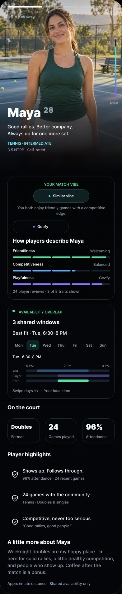
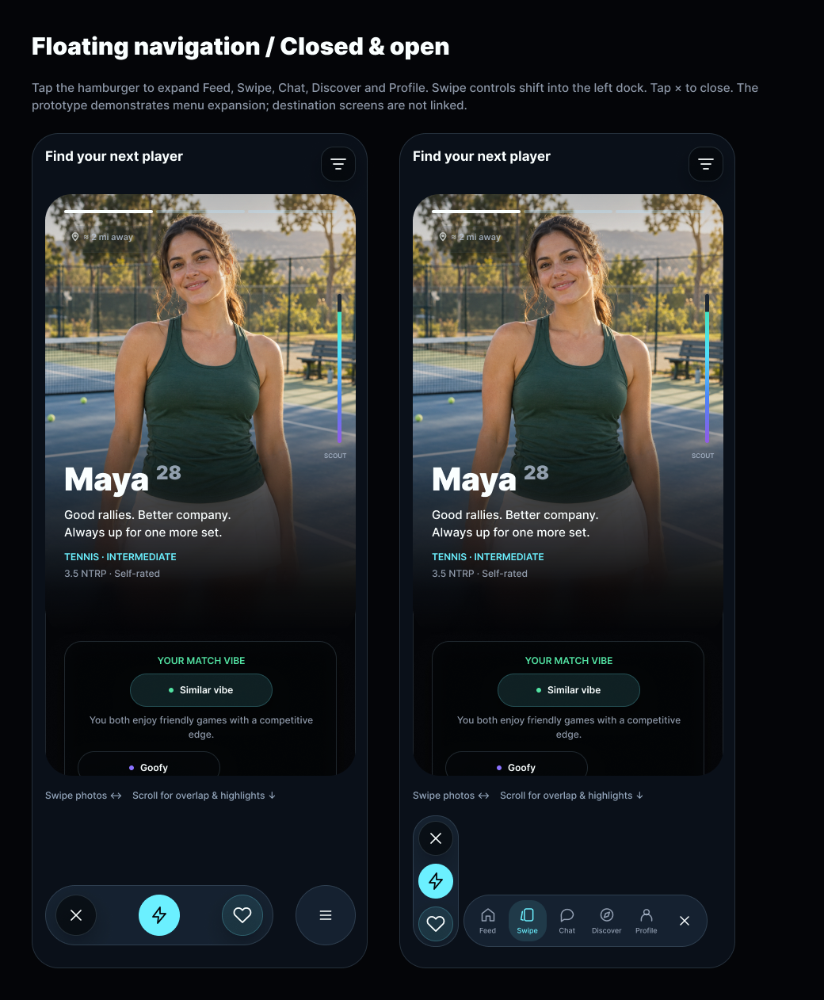
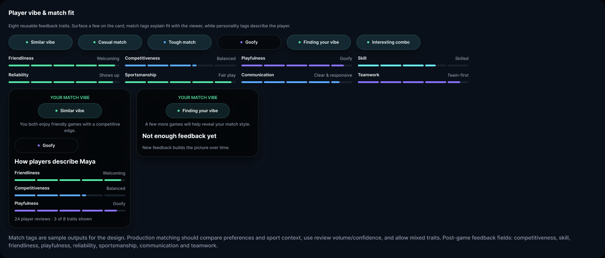

# Tech Plan: Scout V2 Swipe Design

## Status / Owner / Planning Level

Proposed — product/architecture approval required before implementation tickets. Planning author: Stephan; implementation owner unassigned. Level 3: Swipe / Discovery feature.

## References and Scope

- [Figma: 06 / Swipe Card](https://www.figma.com/design/qEktHx6Uo52KgAYNt4VHw3/Scout-V2?node-id=33-2), inspected 2026-09-25, including linked main components on Atoms, Molecules and Organisms.
- Covers the complete card, component catalog, deck and expanding navigation. Other destination screens and previous exploration pages are out of scope.
- `scout-planning`, `scout-ios` and `scout-backend` currently contain README files only. This plan uses the legacy Scout `implementation/proposed/` location and compact sections from its tech-plan template; the new repo has no template or CI yet.
- Reconcile with legacy `Scout/tech-plans/approved/SWIPE-001-discovery-and-recommendation.md`, `PROFILE-001-player-profile-system.md`, and `Scout/docs/architecture/API_BOUNDARIES.md` in ScoutSports before implementation. These remain reference guidance, not an assumed V2 migration approval. No V2 roadmap or Jira item exists for this proposal.

## Problem / Goals / Non-goals

Build the designed immersive deck with reusable SwiftUI components and authoritative backend data. A player can inspect photos, understand fit and shared time, then Pass, Invite or Connect without losing navigation. Do not ship fictional metrics, implement the other tabs, redesign matching rules, or migrate the legacy app as part of this feature.

## UI Components — Complete Swipe Inventory

“New” means required V2 implementation surface, not proof that no equivalent exists in the legacy app. Variant examples are design samples, not production constants. Node IDs identify representative main variants.

| Figma family | Variants / iOS requirement | Main node |
| --- | --- | --- |
| Swipe / Icon / Heart | Connect glyph; accessible label belongs to button | 35:254 |
| Swipe / Icon / Bolt | Invite glyph; reuse in dock | 35:258 |
| Carousel Position | Photo 1/2/3; derive segment count from actual media | 35:183 |
| Distance Chip | Approximate / Hidden; never show coordinates | 35:199 |
| Identity | Name, optional age, intro, sport, skill system/value and self-rated provenance | 35:219 |
| Action Button | Pass / Invite / Connect; add pending, disabled and error recovery | 35:265 |
| Community Rating | Friendliness / Competitive × Rated / New; null is unrated, never zero | 35:26 |
| Highlight Row | Reliability / Games / Style; title, detail, icon | 35:152 |
| Sport Stats | Format, games played, attendance with units and unknown states | 35:240 |
| Vibe Tag | Similar vibe, Casual matchup, Tough matchup, Goofy, Finding your vibe, Interesting combo; distinguish viewer-fit from player personality | 52:2052 |
| Trait Meter | Friendliness, Competitiveness, Playfulness, Skill, Reliability, Sportsmanship, Communication, Teamwork; semantic value and label | 52:2068 |
| Score Heat Rail | Rest / Selected; bottom-up 0–100 fill, tap reveals triangle/exact score, tap dismisses; unavailable state | 115:4488 |
| Availability Day | Mon–Sun; selected day, local-time axis, aligned You/Player/Both lanes subject to privacy decision below | 112:2680 |
| Week Availability | Start=Tuesday example; horizontal day paging + day selection; initial day from data | 112:2947 |
| Availability Overlap | Great / Limited / None; optional summary wrapping weekly view, not a second calendar | 35:58 |
| Player Vibe | Established / Early feedback; fit explanation, personality tag, selected traits and review count | 52:2187 |
| Photo Header | Photo 1/2/3; full-bleed photo fades into continuous dark material, identity, distance and score | 37:418 |
| Photo Carousel | Start 1/2/3; horizontal paging, persistent overlays; zero/one/many-photo handling | 39:551 |
| Player Card | Photo 1/2/3; carousel → vibe → availability → stats → highlights → bio → privacy footer | 37:593 |
| Action Bar | Standalone Pass / Invite / Connect catalog component; shared controls with navigation | 35:292 |
| Expanding Navigation | Collapsed / Expanded; hamburger opens five tabs, actions shift left, menu × closes | 131:3380 |

Reuse shared dependencies: Glass Surface (Subtle/Standard/Elevated/Accent and radius tokens), Glass Icon Button (44-point), Close/Back/Shield/Pin/Filter icons, typography, spacing, colors and icon assets. Also implement the composed deck header/filter entry, vertical card viewport, section headings/bio/footer and loading/empty/error shells; these are layouts, not additional Figma component families. Route Feed, Swipe, Chat, Discover and Profile through the app shell; preserve deck position across navigation.

Legacy reuse candidates include `SwipeDeckScreen`, `SwipeDeckView`, `SwipeCardIdentitySection`, `SwipeCardMatchupSection`, `SwipeStatHighlightsSection`, `SwipeMetricTileView`, `SwipeTagPill` and `AvailabilityGridView`. Audit during implementation; port or extend deliberately instead of copying the legacy app wholesale.

## UX Flow / iOS Requirements

- View → feature view model → discovery repository → typed card model. Views do not decode JSON or call Supabase. The companion BFF response-factory proposal defines the data boundary.
- Photo drags page photos; body drags scroll vertically; availability drags page days. Do not let these gestures submit deck decisions. Buttons are the initial reliable decision path; deck-swipe thresholds remain a product decision.
- Use safe-area layout, not Figma's 424×1054 fixed canvas. Keep actions outside scrolling content. Menu expansion preserves photo/day/scroll state. Differentiate the Pass × from the menu-close × for VoiceOver.
- Display first-load skeleton, retryable error, exhausted/filtered-empty deck, offline banner, missing-media placeholder and no-feedback/no-shared-time states. Cancel stale requests on filter/account changes. Freeze duplicate actions while pending; preserve the card on failure.
- Support Dynamic Type, 44-point targets, VoiceOver order/actions, readable contrast, Reduce Motion and Reduce Transparency. Score/trait meaning must have text, not color alone. Review glass fallback against deployment target before choosing platform APIs.

## Architecture / Backend Requirements

Proposal: a thin TypeScript Supabase Edge Function BFF supplies privacy-safe discovery cards and accepts decisions. Supabase remains auth/storage/Postgres authority. Keep simple authorized CRUD in existing repositories; no Java service or universal server-driven layout engine is needed for this slice.

- Read contract: cursor-paged cards scoped to authenticated viewer + sport + filters; stable candidate IDs, ordered media, safe identity, approximate distance, score with provenance, feedback aggregates/confidence, overlap windows, stats, highlights, bio and permitted actions.
- Compute eligibility, exclusions, ordering, score, fit tags, feedback aggregates and time intersections server-side. Keep ranking score distinct from the public Scout score. Missing/unapproved metrics remain unavailable.
- Write contract: candidate, action, request/idempotency ID and applicable invitation context; return authoritative decision outcome and optional invitation/match ID. Recheck visibility, blocks and eligibility at write time. Invite and Connect semantics require domain approval; do not infer that either immediately creates a match.
- Validate caller JWT and apply caller-scoped RLS; privileged operations require explicit authorization. Client never receives service credentials, full birth date, exact location, private reviews or hidden availability. Use authorized media URLs with expiry handling.

## Database / API Changes

No migrations in this planning PR. Before coding, map each contract field to an approved source and identify actual gaps: profile/media, sports/skill provenance, availability/time zones, feedback aggregates, attendance, discovery decisions and invitations/matches. Any new tables, constraints, indexes, RLS/storage policies or backfills need a reviewed migration plan. Enforce decision deduplication and match uniqueness transactionally; keep business policy in the domain service and integrity guarantees in Postgres.

## Dependencies / Open Decisions / Risks

1. **Availability privacy:** current artwork shows individual lanes, while notes say shared time only. Default proposal returns only overlap plus the viewer's own windows; omit the Player lane until visibility rules and revised UI are approved. Handle DST, midnight boundaries and IANA time zones.
2. **Metrics:** approve public Scout score meaning/formula, feedback minimum sample/confidence, trait scales, fit labels and attendance denominator. Never promote sample 88/100, 4.9 or 96% into defaults.
3. **Catalog drift:** Community Rating and Action Bar remain required reusable variants, but the latest full card emphasizes Player Vibe and Expanding Navigation. Do not add extra ratings solely because older captions mention them. New/Hidden variants contain sample text in their layers; render their intended unavailable/hidden semantics.
4. Confirm sport scope (the design uses tennis/NTRP; legacy Scout began with pickleball), filter behavior, Invite/Connect rules and tab routes. Keep these unresolved items out of implementation tickets until approved.

## Milestones / Testing / Rollout

1. Approve decisions, source-field mapping and BFF contract; then generate small iOS/backend tickets.
2. Build tokens/components and all variants with fixtures; implement authenticated read/decision services and contract tests.
3. Integrate deck, menu and actions; gate rollout with a feature flag. Backend deploys compatible contracts before iOS; disable the flag to roll back without deleting data.

Verify factory fixtures for missing metrics/media; backend tests for cross-user access, blocks, duplicate decisions, pagination and DST; SwiftUI snapshots for variants/small screens/large text; manual device QA for nested gestures, navigation, accessibility and slow/offline retries. Monitor latency, decoding failures and decision errors without logging profile payloads. Current PR is documentation only; no app tests or configured planning CI exist.

## Definition of Done / Jira Breakdown

Approved plan and domain decisions; linked implementation tickets; all inventory rows implemented or explicitly deferred by product; real authorized data replaces samples; privacy and duplicate-write tests pass; visual/accessibility review and rollout sign-off complete. Jira breakdown follows approval; no tickets created by this PR.

## Design Captures

Exported directly from Figma on 2026-09-25; fictional profile and generated sample photography. Images are reference evidence, not production assets.

[Full player card, node 40:1632](https://www.figma.com/design/qEktHx6Uo52KgAYNt4VHw3/Scout-V2?node-id=40-1632)

[Navigation states, node 132:9560](https://www.figma.com/design/qEktHx6Uo52KgAYNt4VHw3/Scout-V2?node-id=132-9560)

[Tags, eight traits and feedback states, node 52:2049](https://www.figma.com/design/qEktHx6Uo52KgAYNt4VHw3/Scout-V2?node-id=52-2049)

